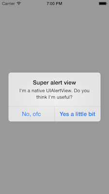

# STAlertView
[](http://cocoadocs.org/docsets/STAlertView)
[](http://cocoadocs.org/docsets/STAlertView)
[](http://cocoadocs.org/docsets/STAlertView)

The idea of this component is to improve the readability while using the native UIAlertView. The UIKit alert view works with delegates. When you have two or more alerts at the same controller, it becomes a problem because you have to use the TAG to identify from which UIAlertView comes the user.

With STAlertView you will be able to define the behavior of the 'Ok' and 'Cancel' button, at the same place where you declare the alert view. So, let's see some code:

```Objective-C
[[STAlertView alloc] initWithTitle:@"Title" 
        message:@"Message"
        cancelButtonTitle:@"Cancel"
        otherButtonTitles:@"Ok"
        cancelButtonBlock:^{
            NSLog(@"do something at cancel");
            
        } otherButtonBlock:^{
            NSLog(@"do something at ok");
            
        }];
```
And that's it, no pieces of code everywhere, just a few lines and all the related code together. As it is a native UIAlertView, the result of using STAlertView is like the native one:



This component has been made thanks to [the answer](http://stackoverflow.com/a/10243357) of [Ricky Helgesson](http://stackoverflow.com/users/947853/ricky-helgesson) at StackOverflow.

## Demo usage

To run the example project, clone the repo, and run `pod install` from the Example directory first.


## Requirements

Is compatible with ARC and non-ARC.

## Installation

STAlertView is available through [CocoaPods](http://cocoapods.org). To install
it, simply add the following line to your Podfile:

    pod "STAlertView"

Then at the view controller that you want to show the alert view add at the .h:

```objective-c
#import <STAlertView/STAlertView.h>
...
@property (nonatomic, strong) STAlertView *alertView;
...
@end
```

And at the .m:

```objective-c
...
self.alertView = [[STAlertView alloc] initWithTitle:@"Title of the alert" 
        message:@"Message you want to show"
        cancelButtonTitle:@"No" otherButtonTitles:@"Yes"
        cancelButtonBlock:^{
            // Code todo when the user cancel
            ...
        } otherButtonBlock:^{
            // Code todo when the user accept
            ...
        }];
...
```

## Author

[Nestor Malet](http://nestor.cat) - [@NestorMalet](http://twitter.com/NestorMalet)

## License

STAlertView is available under the MIT license. See the LICENSE file for more info.
